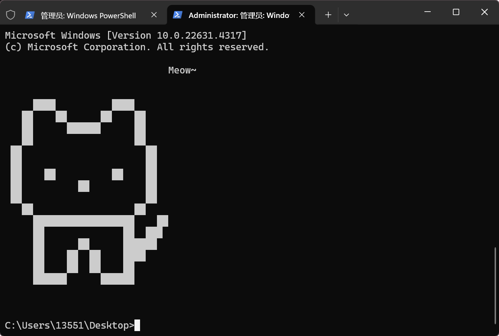
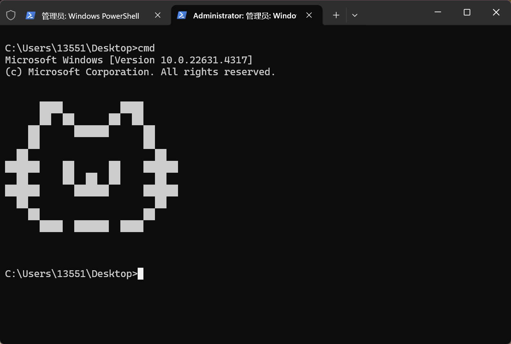

# terminal_pretty

## 效果展示

## Windows 安装说明

**只需下载 `setup_cmd.bat` 文件，然后双击运行即可。**

### 原理及自定义的方式

`setup_cmd.bat` 程序会修改注册表cmd的 `auto_run` 变量，使得cmd每次打开会运行

`C:\Users\<USERNAME>\bin\bashrc.bat`，此程序会调用：

`C:\Users\<USERNAME>\bin\welcome.bat`

而 welcome.bat 的作用是找到./welcome/目录下的所有 .bat 文件，并随机选择一个加载。

所以想要卸载或添加某些终端ASCII图片只需要操作 `C:\Users\<USERNAME>\bin\welcome\` 目录即可，把不想要的图片移动出去，想显示的移动进来。

另外在本项目的 picture 目录还放有两张彩色的ASCII图，请读者尝试让它们也加载进来吧！
